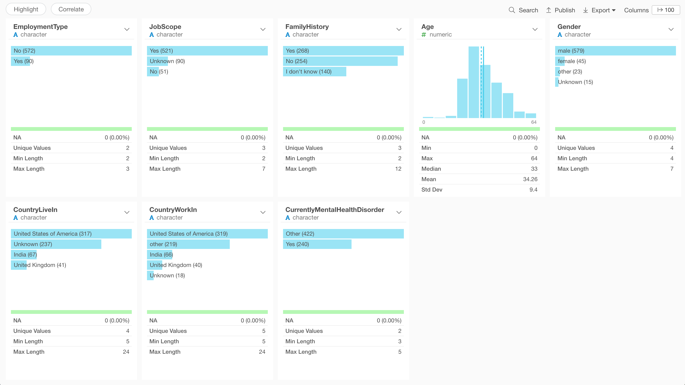

```{r setup, include=FALSE}
knitr::opts_chunk$set(echo = TRUE, warning = FALSE, message = FALSE)
library(dplyr)
library(ggplot2)
library(randomForest)
library(ggmosaic)

dat <- read.csv("eval/DataForModeling8Variables.csv", stringsAsFactors = T) 
dat$CurrentlyMentalHealthDisorder <- factor(dat$CurrentlyMentalHealthDisorder, levels = c("Yes", "Other"), labels = c("Yes", "Other"))
dat_year <- read.csv("eval/DataForModeling9Variables.csv", stringsAsFactors = T) 

Chi_func <- function(v1, v2){
  tb <- table(v1, v2)
  chi <- chisq.test(tb, correct = F)
  chi$p.value
}
```

# Data 

## Data preprocessing

- Pick out factors may related to the cases of mental health disorders at the workplace.
- Extract columns in common and merge three data sets into one.
- Modify the levels of logical columns, change "0", "1" into "No" and "Yes".
- Modify various expression in gender column.
- Reserve the levels of the top 3 countries in CountryLiveIn and CountryWorkIn columns and combine the rest into "others".
- Remove unreasonable age.
- Replace missing value with "unknown".

```{r eval = FALSE}
dat2019 <- read.csv("data/OSMI 2019 Mental Health in Tech Survey Results - OSMI Mental Health in Tech Survey 2019.csv", stringsAsFactors = T)
dat2020 <- read.csv("data/OSMI 2020 Mental Health in Tech Survey Results .csv", stringsAsFactors = T)
dat2021 <- read.csv("data/OSMI 2021 Mental Health in Tech Survey Results .csv", stringsAsFactors = T)

# Data For Modeling (7 Variables)
# Select columns Manually
selected_columns <- c("Do.you..currently..have.a.mental.health.disorder.",
                      "X.Are.you.self.employed..",
                      "Is.your.primary.role.within.your.company.related.to.tech.IT.",
                      "Do.you.have.a.family.history.of.mental.illness.",
                      "What.is.your.age.",
                      "What.is.your.gender.",
                      "What.country.do.you..live..in.",
                      "What.country.do.you..work..in.")
dat2019 <- dat2019 %>% select(selected_columns) %>% mutate(year = "2019")
dat2020 <- dat2020 %>% select(selected_columns) %>% mutate(year = "2020")
dat2021 <- dat2021 %>% select(selected_columns) %>% mutate(year = "2021")

dat <- rbind(dat2019, dat2020) %>% 
  rbind(dat2021)
names(dat) <- c("CurrentlyMentalHealthDisorder",
                "EmploymentType", 
                "JobScope",
                "FamilyHistory",
                "Age",
                "Gender",
                "CountryLiveIn",
                "CountryWorkIn",
                "year")

# Deal with gender
dat$Gender <- tolower(dat$Gender)
dat$Gender[grepl(dat$Gender, pattern = "male")] <- "male"
dat$Gender[grepl(dat$Gender, pattern = "woman")] <- "female"
dat$Gender[grepl(dat$Gender, pattern = "man")] <- "female"
dat$Gender[dat$Gender == "m"] <- "male"
dat$Gender[dat$Gender == "f"] <- "female"
dat$Gender[!(dat$Gender == "male" | dat$Gender == "female")] <- "other"
# check
# table(dat$Gender)

# Deal with CountryLiveIn
dat$CountryLiveIn <- dat$CountryLiveIn %>% as.character()
dat$CountryLiveIn[!(dat$CountryLiveIn == "United States of America" | 
                      dat$CountryLiveIn == "India" | 
                      dat$CountryLiveIn == "United Kingdom")] <- "other"
# Deal with CountryWorkIn
dat$CountryWorkIn <- dat$CountryWorkIn %>% as.character()
dat$CountryWorkIn[!(dat$CountryWorkIn == "United States of America" | 
                      dat$CountryWorkIn == "India" | 
                      dat$CountryWorkIn == "United Kingdom")] <- "other"
# Remove weird Age
dat <- dat %>% 
  filter(Age < 100) %>% 
  filter(Age > 18)

#Group the different age groups into 5 possible age groups
dat$AgeGroup = cut(dat$Age, c(19, 29, 39, 49, 59, Inf), c("<30", "30-39", "40-49", "50-59", ">=60"), include.lowest=TRUE)

# Merge the 4 possible outcomes into 2 outcomes
dat$CurrentlyMentalHealthDisorder <- ifelse(dat$CurrentlyMentalHealthDisorder == "Yes", "Yes", "Other")

#Percentage of Yes/Others group by Employment Type
dat <- dat %>%
  mutate(EmploymentType = ifelse(EmploymentType == 1 & !is.na(EmploymentType), "Self-Employed","Employed"))

#Rename the Job Scope into Tech, Non Tech and Unknown
dat$JobScope = if_else(dat$JobScope == 1, true= "Tech", false="Non-Tech", missing = "Unknown")

# Deal with missing value
dat$Gender[is.na(dat$Gender)] <- "Unknown"
dat$CountryLiveIn[is.na(dat$CountryLiveIn)] <- "Unknown"
dat$CountryWorkIn[is.na(dat$CountryWorkIn)] <- "Unknown"
for(i in names(dat)){
  if(is.character(dat[[i]])){
    dat[[i]] <- as.factor(dat[[i]])
  }
}
write.csv(dat, file = "eval/DataForModeling9Variables.csv", row.names = F)
dat <- dat %>% select(-year)
write.csv(dat, file = "eval/DataForModeling8Variables.csv", row.names = F)

```

## Cleaned data

After data manipulation, the data distribution are showed below.



## Relationships between independent variable and dependent variable

The dependent variable is categorical variable, and the independent variables are both numerical and categorical variables.

We will use spine plot to illustrate the constitution of each category between two categorical variables. On the other hand, we will use box plot to display the distribution between one numerical variable and one categorical variable.

1. EmploymentType vs. CurrentlyMentalHealthDisorder    

```{r, echo = F}
spineplot(factor(dat$EmploymentType)~factor(dat$CurrentlyMentalHealthDisorder), 
          xlab = "CurrentlyMentalHealthDisorder", ylab = "Employment Type",
          col = palette("Tableau"))
```
```{r}
spineplot(factor(dat$CurrentlyMentalHealthDisorder)~factor(dat$EmploymentType), 
          xlab = "Employment Type", ylab = "Mental Health Disorder",
          col = palette("Tableau"))
```

2. JobScope vs. CurrentlyMentalHealthDisorder

```{r, echo = F}
spineplot(factor(dat$CurrentlyMentalHealthDisorder) ~ factor(dat$JobScope), 
          ylab = "CurrentlyMentalHealthDisorder", xlab = "JobScope",
          col = palette("Tableau"))
```
```{r}
spineplot(factor(dat$CurrentlyMentalHealthDisorder)~factor(dat$JobScope),
          xlab = "Job Scope", ylab = "Mental Health Disorder",
          col = palette("Tableau"))
```

3. FamilyHistory vs. CurrentlyMentalHealthDisorder

```{r, echo = F}
spineplot(factor(dat$CurrentlyMentalHealthDisorder) ~ factor(dat$FamilyHistory), 
          xlab = "FamilyHistory", ylab = "CurrentlyMentalHealthDisorder", 
          col = palette("Tableau"))
```
```{r}
spineplot(factor(dat$CurrentlyMentalHealthDisorder)~factor(dat$FamilyHistory), 
          xlab = "Family History", ylab = "Mental Health Disorder",
          col = palette("Tableau"))
```

4. Gender vs. CurrentlyMentalHealthDisorder

```{r, echo = F}
spineplot(factor(dat$CurrentlyMentalHealthDisorder) ~ factor(dat$Gender),
          xlab = "Gender", ylab = "CurrentlyMentalHealthDisorder", 
          col = palette("Tableau"))
```
```{r}
spineplot(factor(dat$CurrentlyMentalHealthDisorder)~factor(dat$Gender), 
          xlab = "Gender", ylab = "Mental Health Disorder",
          col = palette("Tableau"))
```

5. CountryLiveIn vs. CurrentlyMentalHealthDisorder

```{r}
ggplot(data = dat) +
  geom_mosaic(aes(x = product(CurrentlyMentalHealthDisorder, CountryLiveIn),
                  fill = CurrentlyMentalHealthDisorder)) + 
  labs(y = "Mental Health Disorder",x ="Country", fill = "Mental Health Disorder") +
  theme(axis.text.y=element_blank(),
        axis.ticks.y=element_blank(),
        axis.text.x = element_text(angle = 60, hjust = 1))
```


6. CountryWorkIn vs. CurrentlyMentalHealthDisorder

```{r}
ggplot(data = dat) +
  geom_mosaic(aes(x = product(CurrentlyMentalHealthDisorder, CountryWorkIn),
                  fill = CurrentlyMentalHealthDisorder)) + 
  labs(y = "Mental Health Disorder",
       x = "Country", 
       fill = "Mental Health Disorder") +
  theme(axis.text.y=element_blank(),
        axis.ticks.y=element_blank(),
        axis.text.x = element_text(angle = 60, hjust = 1))
```

7. AgeGroup vs. CurrentlyMentalHealthDisorder
```{r}
ggplot(data = dat) +
  geom_mosaic(aes(x = product(CurrentlyMentalHealthDisorder, AgeGroup),
                  fill = CurrentlyMentalHealthDisorder)) + 
  labs(y = "Mental Health Disorder", x= "Age Group", fill = "Mental Health Disorder") +
  theme(axis.text.y=element_blank(),
        axis.ticks.y=element_blank(),
        axis.text.x = element_text(angle = 60, hjust = 1))
```

# Approach and Methodology

## Question 1: What are the factors that might explain cases of mental health disorders at the workplace?

We build a random forest model to predict ‘Do you currently have a mental health disorder’. The confusion matrix we have is as listed below.

```{r}
set.seed(5)
dat <- read.csv("eval/DataForModeling8Variables.csv")
dat$CurrentlyMentalHealthDisorder <- factor(dat$CurrentlyMentalHealthDisorder, levels = c("Yes", "Other"), labels = c("Yes", "Other"))

rf1 <- randomForest(CurrentlyMentalHealthDisorder ~ EmploymentType + JobScope + FamilyHistory + Gender + CountryLiveIn + CountryWorkIn + AgeGroup, 
                   data=dat,
                   na.action = na.omit) 
print(rf1)
```

We apply grid search to do the hyperparameter tuning.
First, we try to find the number of features to consider at each split point(mtry) which resulted to the lowest error.

As you can see, the lowest OOB Error is achieved when the mtry is 2.

```{r}
# number of variables at each split
rf1.tune <- tuneRF(dat[, -which(names(dat) == "CurrentlyMentalHealthDisorder")], dat$CurrentlyMentalHealthDisorder, doBest=T) 
```

Then we search for the number of trees grown(ntree).
The plot below shows the result we tried ntree=2000. We can see that the OOB Error rate converges around when ntree is around 500, the default number.

```{r}
rf2 <- randomForest(CurrentlyMentalHealthDisorder ~ EmploymentType + JobScope + FamilyHistory + Gender + CountryLiveIn + CountryWorkIn + AgeGroup, 
                     dat, ntree = 2000)
oob_err_data <- data.frame(
  Trees = rep(1:nrow(rf2$err.rate), 3), 
  Type = rep(c("OOB","Yes","Other"), each = nrow(rf2$err.rate)),
  Error = c(rf2$err.rate[,"OOB"], rf2$err.rate[,"Yes"], rf2$err.rate[,"Other"]))

ggplot(data = oob_err_data, aes(x = Trees, y= Error)) + 
  geom_line(aes(color = Type))
```

Finally, we build our random forest model by specify the best value of the arguments.

```{r}
rf3 <-  randomForest(CurrentlyMentalHealthDisorder ~ EmploymentType + JobScope + FamilyHistory + Gender + CountryLiveIn + CountryWorkIn + AgeGroup, 
                     data=dat,
                     na.action = na.omit,
                     mtry=2,
                     ntree=500)
# print(rf3)
caret::confusionMatrix(predict(rf3, newdata = dat),
                       dat$CurrentlyMentalHealthDisorder)
```

The feature importance of the model is listed below.

```{r}
varImpPlot(rf3, sort = TRUE)
```

To determine whether these factors are significant factors in determining one’s likelihood of developing mental health disorders, we have decided to run the chi-squared test and t-test. The resulting p-value here can be seen as a measure of the correlation between these two variables. The result shown below tells us that Family history, Country that one works in, and Country that one lives in are significant factors.

```{r}
Chi_func <- function(v1, v2){
  tb <- table(v1, v2)
  chi <- chisq.test(tb, correct = F)
  chi$p.value
}

# FamilyHistory 
Chi_func(dat$FamilyHistory, dat$CurrentlyMentalHealthDisorder)

# AgeGroup
Chi_func(dat$AgeGroup, dat$CurrentlyMentalHealthDisorder)

# CountryWorkIn
Chi_func(dat$CountryWorkIn, dat$CurrentlyMentalHealthDisorder)

# CountryLiveIn 
Chi_func(dat$CountryLiveIn, dat$CurrentlyMentalHealthDisorder)

# Gender
Chi_func(dat$Gender, dat$CurrentlyMentalHealthDisorder)

#Employment Type
Chi_func(dat$EmploymentType, dat$CurrentlyMentalHealthDisorder)

#Jobscope
Chi_func(dat$JobScope, dat$CurrentlyMentalHealthDisorder)
```

### Question 2: How has the pandemic changed the prevalence of mental health disorders?

```{r}
dat_year <- read.csv("eval/DataForModeling9Variables.csv", stringsAsFactors = T) 
dat_year$Pandemic <- ifelse(dat_year$year < 2020, "Before", "After")
tb <- table(dat_year$CurrentlyMentalHealthDisorder, 
            dat_year$Pandemic)
chi <- chisq.test(tb, correct = F)
chi$p.value
```

We run the chi-squared test and the resulting p-value here can be seen as a measure of the correlation between these two variables. Since the p-value < 0.05, we can reject the null hypothesis. In other words, the prevalence of mental health disorders is related to the pandemic.

### Question 3: How have the attitudes towards mental health been before or after the pandemic?

There are two features are associated with this research question:

1. Would you feel comfortable discussing a mental health issue with your direct supervisor?

```{r}
dat2019 <- read.csv("data/OSMI 2019 Mental Health in Tech Survey Results - OSMI Mental Health in Tech Survey 2019.csv", stringsAsFactors = T) %>%
	select(DiscussWithSupervisor = `Would.you.feel.comfortable.discussing.a.mental.health.issue.with.your.direct.supervisor.s..`) %>%
	mutate(year = 2019)
dat2020 <- read.csv("data/OSMI 2020 Mental Health in Tech Survey Results .csv", stringsAsFactors = T) %>%
	select(DiscussWithSupervisor = `Would.you.feel.comfortable.discussing.a.mental.health.issue.with.your.direct.supervisor.s..`) %>%
	mutate(year = 2020)
dat2021 <- read.csv("data/OSMI 2021 Mental Health in Tech Survey Results .csv", stringsAsFactors = T) %>%
	select(DiscussWithSupervisor = `Would.you.feel.comfortable.discussing.a.mental.health.issue.with.your.direct.supervisor.s..`) %>%
	mutate(year = 2021)
dat <- rbind(dat2019, dat2020) %>% 
  rbind(dat2021)

dat$Pandemic <- ifelse(dat$year < 2020, "Before", "After")
tb <- table(dat$DiscussWithSupervisor, 
            dat$Pandemic)
chi <- chisq.test(tb, correct = F)
chi$p.value
```

2. Would you feel comfortable discussing a mental health issue with your coworkers?

```{r}
dat2019 <- read.csv("data/OSMI 2019 Mental Health in Tech Survey Results - OSMI Mental Health in Tech Survey 2019.csv", stringsAsFactors = T) %>%
  select(DiscussWithCoworkers = `Would.you.feel.comfortable.discussing.a.mental.health.issue.with.your.coworkers.`) %>%
  mutate(year = 2019)
dat2020 <- read.csv("data/OSMI 2020 Mental Health in Tech Survey Results .csv", stringsAsFactors = T) %>%
  select(DiscussWithCoworkers = `Would.you.feel.comfortable.discussing.a.mental.health.issue.with.your.coworkers.`) %>%
  mutate(year = 2020)
dat2021 <- read.csv("data/OSMI 2021 Mental Health in Tech Survey Results .csv", stringsAsFactors = T) %>%
  select(DiscussWithCoworkers = `Would.you.feel.comfortable.discussing.a.mental.health.issue.with.your.coworkers.`) %>%
  mutate(year = 2021)
dat <- rbind(dat2019, dat2020) %>%
  rbind(dat2021)

dat$Pandemic <- ifelse(dat$year < 2020, "Before", "After")
tb <- table(dat$DiscussWithCoworkers,
            dat$Pandemic)
chi <- chisq.test(tb, correct = F)
chi$p.value
```

We found that they have opposite results. The level of comfortableness discussing a mental health issue with the staff’s direct supervisor is different after the pandemic. On the contrary, there is no statistical difference in discussions with the staff’s coworkers.

